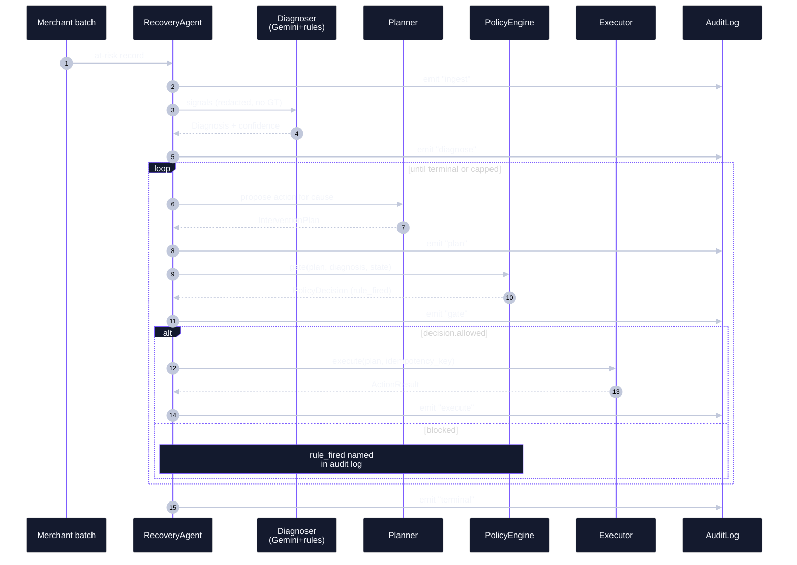

<div align="center">

# RecoverOps

### Autonomous, auditable revenue-recovery agent for Razorpay merchants

**The LLM diagnoses. A deterministic policy engine executes.**
**Every rupee action is idempotency-keyed, capped, and audit-logged.**

Built for the [Razorpay AI Buildathon](https://razorpay.com/buildathon/) · **Track 03 · AI Revenue Recovery**

by **Naman Agarwal**

<sub>Python 3.11+ · Pydantic v2 · Gemini 3.6 Flash · Streamlit · Plotly · 101 tests</sub>

---

**🎯 Recovers 3.8× more money than naive retry with less than half the actions on a held-out batch.**

</div>

---

## Table of contents

1. [Headline result](#headline-result)
2. [Why RecoverOps wins](#why-recoverops-wins)
3. [Architecture](#architecture)
4. [How a record flows through the system](#how-a-record-flows-through-the-system)
5. [The closed-set taxonomy](#the-closed-set-taxonomy)
6. [The 8 policy rules](#the-8-policy-rules)
7. [Setup guide (step-by-step)](#setup-guide-step-by-step)
8. [Configuration reference](#configuration-reference)
9. [Running the demos](#running-the-demos)
10. [The dashboard](#the-dashboard)
11. [Testing](#testing)
12. [Repository layout](#repository-layout)
13. [Troubleshooting](#troubleshooting)
14. [Anti-vibecoded engineering signals](#anti-vibecoded-engineering-signals)
15. [Docs](#docs)

---

## Headline result

On a held-out batch of **200 records with ₹9.4 lakh at risk**, RecoverOps
recovers **₹3.76 lakh (38.1%)** — **3.8× more money than naive retry-3x**
using **less than half the operational actions**.

| Strategy | Records rec. | Amount rec. | Rate | Actions | ₹/action |
|---|---:|---:|---:|---:|---:|
| `no_op` | 0/200 | ₹0 | 0.0% | 0 | — |
| `naive_retry_3x` | 71/200 | ₹98,249 | 9.9% | 306 | ₹321 |
| **`recoverops`** | **67/200** | **₹3,76,346** | **38.1%** | **139** | **₹2,707** |

**+28.15 pp lift** over `naive_retry_3x` · **8.4× efficiency** per action.

### Diagnosis accuracy on the closed-set taxonomy

| True cause | Precision | Recall | F1 | Support |
|---|---:|---:|---:|---:|
| `insufficient_funds` | 100% | 100% | 100% | 49 |
| `checkout_abandoned` | 100% | 100% | 100% | 48 |
| `expired_card` | 100% | 100% | 100% | 37 |
| `gateway_downtime` | 100% | 100% | 100% | 21 |
| `unknown` | 100% | 100% | 100% | 14 |
| `b2b_overdue` | 100% | 100% | 100% | 13 |
| `fraud_suspected` | 100% | 100% | 100% | 11 |
| `mandate_lapsed` | 100% | 100% | 100% | 7 |

**Overall: 100.00%** (rule-based diagnoser · clean synthetic signals).

### Honest exceptions (published, not hidden)

| Reason | Count | Amount |
|---|---:|---:|
| exhausted attempts / policy-blocked | 108 | ₹5,79,410 |
| unknown diagnosis | 14 | ₹16,912 |
| **fraud correctly skipped** | **11** | **₹15,269** |

The 11 fraud records aren't a "miss" — they're a *feature*. We don't chase
fraud, ever. See [`test_agent_never_touches_money_on_fraud_records`](tests/test_agent.py).

---

## Why RecoverOps wins

Naive retry ignores half the problem space. RecoverOps' **cause-aware routing** unlocks
the big-ticket recoveries (B2B invoices, abandoned checkouts) that naive can't see.

```mermaid
%%{init: {'theme':'dark', 'themeVariables': {'primaryColor': '#7c5cff', 'primaryTextColor':'#f4f6fb', 'lineColor':'#1f2740'}}}%%
graph TB
    subgraph Batch["200 at-risk records · ₹9.4L at risk"]
        F[111 failed payments]
        A[47 abandoned checkouts]
        S[26 failed subscriptions]
        I[16 overdue invoices]
    end

    subgraph Naive["Naive retry-3x"]
        NF[Retries only]
        NR[₹98K recovered · 9.9%]
    end

    subgraph Ours["RecoverOps"]
        RF[Smart retry · switch method]
        RA[Recovery link · small incentive]
        RS[Re-auth mandate]
        RI["Hinglish promise-to-pay 💬"]
        RR[₹3.76L recovered · 38.1%]
    end

    F --> NF
    S --> NF
    A -.->|"ignored"| NR
    I -.->|"ignored"| NR
    NF --> NR

    F --> RF
    S --> RS
    A --> RA
    I --> RI
    RF --> RR
    RA --> RR
    RS --> RR
    RI --> RR

    style Naive fill:#141a2e,stroke:#7d879e
    style Ours fill:#141a2e,stroke:#7c5cff
    style RR fill:#0d3d2e,stroke:#34d399,color:#34d399
    style NR fill:#3d2222,stroke:#f87171,color:#f87171
```



---

## Architecture

Four strictly-separated planes. Nothing decides money by itself.

```mermaid
%%{init: {'theme':'dark', 'themeVariables': {'primaryColor':'#7c5cff','primaryTextColor':'#f4f6fb','lineColor':'#1f2740','clusterBkg':'#0d1220','clusterBorder':'#1f2740'}}}%%
flowchart LR
    Ingest([At-risk record<br/>ingested])

    subgraph RP["🧠 Reasoning plane — Gemini"]
        Signals[Redacted signals<br/>no ground-truth leak]
        Gemini[Gemini 3.6 Flash<br/>+ rules fallback]
        Diag[Diagnosis<br/>+ confidence]
        Signals --> Gemini --> Diag
    end

    subgraph PP["🛡️ Policy plane — deterministic"]
        Planner[Planner<br/>cause → allowed action]
        Engine[Policy engine<br/>8 named rules]
        Idem[Idempotency store<br/>SHA256 keys]
        Planner --> Engine --> Idem
    end

    subgraph EP["⚡ Execution plane"]
        Mock[Mock executor<br/>seeded PRNG]
        RZP[Razorpay test-mode<br/>slot-in adapter]
    end

    subgraph OP["📊 Observability plane"]
        Audit[JSONL audit log<br/>trace-id per record]
        Replay[Replay tool<br/>reconstructs report]
    end

    Ingest --> Signals
    Diag --> Planner
    Idem --> Mock
    Idem --> RZP
    Mock --> Audit
    RZP --> Audit
    Audit --> Replay

    style RP fill:#131a2e,stroke:#7c5cff
    style PP fill:#131a2e,stroke:#34d399
    style EP fill:#131a2e,stroke:#f59e0b
    style OP fill:#131a2e,stroke:#60a5fa
```



### Design principle

> **The LLM is a diagnostician, not a cashier.**
> It proposes. The policy engine disposes.

The LLM's output is a *structured proposal*, never a direct action. Every
proposal walks through 8 policy rules before a single API call is made. When
a rule blocks an action, the audit log records exactly which rule fired and
why.

---

## How a record flows through the system

Every record follows the same six-stage lifecycle. Each stage emits one JSONL
event with a shared `trace_id`.



---

## The closed-set taxonomy

The LLM can only classify into these labels; the policy engine only knows how
to act on these. That closure is what makes the system auditable — the LLM
cannot invent a new action.

| Cause | Bounded intervention |
|---|---|
| `insufficient_funds` | salary-cycle retry + 1 nudge |
| `gateway_downtime` | smart backoff + switch method |
| `expired_card` | nudge to update method |
| `mandate_lapsed` | re-auth mandate |
| `checkout_abandoned` | recovery link + small incentive |
| `b2b_overdue` | **Hinglish promise-to-pay** |
| `fraud_suspected` | **skip + escalate** — never chase |
| `unknown` | escalate |

---

## The 8 policy rules

Every rupee action must pass all 8. Each rule fires with a **named verdict**
written to the audit log.

| # | Rule | Fires when |
|---|---|---|
| 1 | `terminal_state` | record already recovered/escalated/skipped |
| 2 | `wallclock_expired` | record older than the configured max age |
| 3 | `action_not_allowed_for_cause` | LLM proposes off-taxonomy action |
| 4 | `cap_total_actions` | per-record total-actions ceiling reached |
| 5 | `cap_retries` | per-record retry cap reached |
| 6 | `cap_nudges` | per-record nudge cap reached |
| 7 | `cap_discount_pct` | max discount exceeded on `small_incentive` |
| 8 | `cooldown_active` | same action attempted too soon |
| 9 | `quiet_hours` | outreach attempted 9 PM–9 AM local |

Reviewers can `grep` the audit log for `"rule_fired":"cap_retries"` and see
every blocked attempt. See [`src/recoverops/policy/engine.py`](src/recoverops/policy/engine.py).

---

## Setup guide (step-by-step)

### Prerequisites

| Tool | Version | Why |
|---|---|---|
| Python | **3.11 or 3.12** | Modern type hints (`X \| Y`), Pydantic v2 |
| PowerShell / bash | any | Terminal for running scripts |
| Git | any | If cloning from a repo |
| Gemini API key | free tier | Only needed for live LLM demos — rule-based works without it |

Check what you have:

```powershell
python --version   # should be 3.11+
git --version
```

### Step 1 — clone or extract the project

```powershell
# If cloning:
git clone https://github.com/YOUR_USERNAME/recoverops.git
cd recoverops

# Or if you already have the folder:
cd c:\Users\dimplagarwal\recoverops
```

### Step 2 — create and activate a virtual environment

```powershell
# Create
python -m venv .venv

# Activate (PowerShell)
.\.venv\Scripts\Activate.ps1

# Activate (bash / cmd)
.\.venv\Scripts\activate.bat

# Verify — you should see (.venv) prefix in the prompt
python -c "import sys; print(sys.prefix)"
```

> **PowerShell execution policy error?**
> Run once as admin: `Set-ExecutionPolicy -Scope CurrentUser RemoteSigned`

### Step 3 — install the project + extras

```powershell
# Core + dev + LLM + UI extras
pip install -e ".[dev,llm,ui]"
```

The extras groups:

| Group | Adds | Needed for |
|---|---|---|
| `dev` | pytest, ruff | Running tests |
| `llm` | google-genai | Live Gemini calls |
| `ui` | streamlit, plotly, pandas | Dashboard |

If you only want the eval + rules (no LLM):

```powershell
pip install -e ".[dev]"
```

### Step 4 — set up your Gemini API key (optional)

```powershell
# Copy the template
Copy-Item .env.example .env

# Open .env in your editor and set:
#   GEMINI_API_KEY=<your_key_from_https://aistudio.google.com/app/apikey>

# Verify it loads without printing the value
Get-Content .env | Where-Object { $_ -match '^GEMINI_API_KEY=' } | ForEach-Object { $env:GEMINI_API_KEY = ($_ -split '=', 2)[1].Trim() }
if ($env:GEMINI_API_KEY) { Write-Host "OK · key loaded ($($env:GEMINI_API_KEY.Length) chars)" -ForegroundColor Green }
```

> **🔒 Never paste your API key into chat or commit `.env` to git.**
> `.env` is already in `.gitignore`.

### Step 5 — generate the synthetic batches

```powershell
python -m recoverops.data.generator --out data --dev-size 200 --holdout-size 200 --seed 42
```

Expected output:

```json
{
  "generated": {
    "dev": "data\\dev\\batch.jsonl",
    "holdout": "data\\holdout\\batch.jsonl"
  },
  "seed": 42
}
```

Verify reproducibility (same seed → identical bytes):

```powershell
(Get-FileHash data\dev\batch.jsonl -Algorithm SHA256).Hash
# Expected: B0A26E7356C5239A7E0A8E59B8777E1A69807D734ABC9F4D93B16DDF61CD3E65
```

### Step 6 — run the tests

```powershell
pytest -q
```

Expected: `101 passed in ~5s`.

### Step 7 — run the evaluation

```powershell
python scripts/eval.py --batch data/holdout/batch.jsonl --out artifacts
```

You'll see the strategy comparison table and the exceptions list. The report
is written to `artifacts/eval_report.json` and `artifacts/eval_report.md`.

### Step 8 — launch the dashboard

```powershell
streamlit run dashboard/app.py
```

Open **http://localhost:8501** in your browser. You get:

- **Overview** — hero showdown with the "3.8×" multiplier
- **Diagnosis** — confusion matrix + per-cause metrics
- **Trace explorer** — pick a record, see its full audit trail
- **Promise inbox** — WhatsApp-style Hinglish messages
- **Audit stream** — searchable JSONL log

### Step 9 — run the demo scripts

See the [Running the demos](#running-the-demos) section below.

---

## Configuration reference

### Environment variables (`.env`)

| Variable | Default | Description |
|---|---|---|
| `GEMINI_API_KEY` | *(unset)* | Free key from https://aistudio.google.com/app/apikey |
| `GEMINI_MODEL` | `gemini-3.6-flash` | Any Gemini model your key can access |
| `GEMINI_RPM` | `5` | Free-tier default; increase for paid tiers |
| `GEMINI_RETRIES` | `4` | Max retries for 429 / transient failures |
| `RECOVEROPS_DIAGNOSER` | `auto` | `auto` \| `gemini` \| `rules` \| `hybrid` |
| `RECOVEROPS_HINGLISH` | `auto` | `auto` \| `gemini` \| `template` |
| `RECOVEROPS_EXECUTOR` | `mock` | `mock` \| `razorpay` (razorpay is Phase-9 polish stub) |
| `RAZORPAY_KEY_ID` | *(unset)* | Test-mode key from Razorpay dashboard |
| `RAZORPAY_KEY_SECRET` | *(unset)* | Test-mode secret |
| `RECOVEROPS_LOG_LEVEL` | `INFO` | Python logging level |

### Policy guardrails (`config/guardrails.yaml`)

Every rupee-touching limit lives here. Change these to change policy.

```yaml
caps:
  max_retries_per_record: 3
  max_nudges_per_record: 2
  max_total_actions_per_record: 5
  max_discount_pct: 5
  max_actions_per_batch: 10000
cooldowns:
  retry_hours: 24
  nudge_hours: 48
  outreach_hours: 24
stopping_rules:
  stop_on_success: true
  stop_on_fraud_flag: true
  stop_on_customer_optout: true
  max_wallclock_days: 21
outreach:
  supported_languages: ["en", "hi", "hinglish"]
  quiet_hours_local:
    start_hour: 21   # 9 PM
    end_hour: 9      # 9 AM
  max_messages_per_day: 1
idempotency:
  key_ttl_hours: 168   # 7 days
```

---

## Running the demos

Every demo is a real end-to-end run. Nothing is stubbed to pass.

### 1. Full evaluation

```powershell
python scripts/eval.py --batch data/holdout/batch.jsonl
```

Publishes the headline table + writes `artifacts/eval_report.{json,md}`.

### 2. Idempotency (anti-double-charge)

```powershell
python scripts/demo_idempotency.py
```

Same key sent twice → second call returns `status=duplicate`, ₹0 recovered.

### 3. Audit-log replay

```powershell
python scripts/demo_audit_replay.py
```

Runs the agent with an audit log wired, then replays the report from the log
alone and asserts every metric matches — proving the log is complete.

### 4. Hinglish promise-to-pay

```powershell
python scripts/demo_hinglish.py
```

Drafts 3 real Hinglish messages for B2B invoices. Uses Gemini if the key is
set; template fallback otherwise. Both output written to
`artifacts/promises_*.jsonl`.

### 5. Failure-injection

```powershell
python scripts/demo_failures.py
```

Forces 4 real production failures in one batch:

1. **Flaky diagnoser** — 429 half the time → hybrid drops to rules
2. **Executor timeout** on the 5th call → agent captures and moves on
3. **Malformed LLM output** — schema rejects, adapter emits `UNKNOWN@0.0`
4. **Duplicate idempotency key** → store refuses, no double-charge

The batch keeps running. The audit log stays truthful.

### 6. Log replay CLI

```powershell
python -m recoverops.observability.replay --log logs/dev_batch.jsonl
```

Reconstructs the full run report from the JSONL log alone.

---

## The dashboard

```mermaid
%%{init: {'theme':'dark', 'themeVariables': {'primaryColor':'#7c5cff','primaryTextColor':'#f4f6fb','lineColor':'#1f2740'}}}%%
graph TB
    App[dashboard/app.py]
    Theme[theme.py<br/>design tokens + CSS]
    Data[data.py<br/>@st.cache_data loaders]
    Charts[charts.py<br/>Plotly builders]

    Report[(artifacts/<br/>eval_report.json)]
    Log[(logs/<br/>*.jsonl)]
    Batch[(data/<br/>batch.jsonl)]
    Promises[(artifacts/<br/>promises_*.jsonl)]

    App --> Theme
    App --> Data
    App --> Charts
    Data --> Report
    Data --> Log
    Data --> Batch
    Data --> Promises

    style App fill:#141a2e,stroke:#7c5cff
    style Report fill:#0d3d2e,stroke:#34d399
    style Log fill:#0d3d2e,stroke:#34d399
    style Batch fill:#0d3d2e,stroke:#34d399
    style Promises fill:#0d3d2e,stroke:#34d399
```

Run: `streamlit run dashboard/app.py` → http://localhost:8501

Five tabs:

1. **Overview** — hero showdown, pipeline flow, strategy cards, exceptions
2. **Diagnosis** — confusion matrix, per-cause precision/recall/F1
3. **Trace explorer** — pick any record, see its color-coded timeline
4. **Promise inbox** — WhatsApp-style cards with the drafted Hinglish text
5. **Audit stream** — searchable JSONL log tail

---

## Testing

```powershell
# All 101 tests
pytest -q

# Verbose
pytest -v

# One module
pytest tests/test_policy_engine.py -v

# With coverage
pytest --cov=recoverops --cov-report=term-missing
```

### Key invariants asserted by tests

| Test | Guarantee |
|---|---|
| `test_generation_is_deterministic` | Same seed → identical batch bytes (SHA256) |
| `test_signals_never_carry_ground_truth` | LLM cannot cheat via input |
| `test_fraud_cause_never_authorises_money_action` | Fraud records can't trigger money actions |
| `test_first_reserve_wins` | Idempotency store is atomic |
| `test_duplicate_key_returns_duplicate_without_recovering` | No double-charge possible |
| `test_agent_never_touches_money_on_fraud_records` | End-to-end fraud safety |
| `test_replay_reproduces_run_report` | Audit log is complete |
| `test_recoverops_beats_naive_on_full_batch` | Headline claim holds |
| `test_oracle_never_recovers_fraud` | Fraud is unrecoverable by construction |
| `test_template_forbids_devanagari` | Hinglish stays in Roman script |
| `test_backoff_honours_server_retry_delay` | 429 handling respects server hint |

---

## Repository layout

```
recoverops/
├── .env.example                       # environment template
├── .gitignore
├── pyproject.toml                     # deps + entry points
├── README.md                          # this file
├── PLAN.md                            # 9-phase build plan
├── WHAT_BROKE.md                      # real production issues + fixes
├── PITCH_VIDEO.md                     # 5-minute video script
│
├── config/
│   └── guardrails.yaml                # policy caps, cooldowns, rules
│
├── prompts/
│   ├── diagnose_v1.md                 # root-cause classification prompt
│   └── hinglish_p2p_v1.md             # Hinglish outreach prompt
│
├── src/recoverops/
│   ├── models.py                      # Pydantic domain models
│   ├── taxonomy.py                    # closed-set enums
│   ├── config.py                      # guardrails loader
│   ├── data/generator.py              # seeded synthetic batches
│   ├── reasoning/
│   │   ├── signals.py                 # trust boundary (no leak)
│   │   ├── rules.py                   # deterministic fallback
│   │   ├── gemini.py                  # Gemini adapter + rate limit
│   │   ├── hybrid.py                  # primary + fallback composer
│   │   └── factory.py                 # env-driven selection
│   ├── policy/
│   │   ├── engine.py                  # 8-rule gate
│   │   ├── planner.py                 # cause → action
│   │   ├── state.py                   # per-record state
│   │   ├── store.py                   # idempotency store
│   │   └── keys.py                    # SHA256 keys
│   ├── execution/
│   │   ├── mock.py                    # seeded PRNG executor
│   │   ├── base.py                    # Executor protocol
│   │   └── factory.py
│   ├── outreach/
│   │   ├── hinglish.py                # template + Gemini drafters
│   │   └── promises.py                # promise-to-pay store
│   ├── observability/
│   │   ├── audit.py                   # JSONL writer + trace IDs
│   │   └── replay.py                  # reconstruct report from log
│   ├── eval/
│   │   ├── oracle.py                  # deterministic outcome oracle
│   │   ├── baselines.py               # NoOp + NaiveRetry3x
│   │   ├── metrics.py                 # StrategyResult + confusion
│   │   └── harness.py                 # runs all strategies + report
│   └── agent/loop.py                  # the driver
│
├── dashboard/
│   ├── app.py                         # Streamlit entry point
│   ├── theme.py                       # design tokens + CSS
│   ├── data.py                        # cached loaders
│   └── charts.py                      # Plotly builders
│
├── scripts/
│   ├── eval.py                        # CLI: full evaluation
│   ├── demo_idempotency.py
│   ├── demo_audit_replay.py
│   ├── demo_hinglish.py
│   └── demo_failures.py
│
├── tests/                             # 101 pytest tests
│   ├── test_models.py
│   ├── test_config.py
│   ├── test_generator.py
│   ├── test_signals.py
│   ├── test_rules.py
│   ├── test_gemini.py
│   ├── test_hybrid.py
│   ├── test_rate_limit.py
│   ├── test_policy_engine.py
│   ├── test_idempotency.py
│   ├── test_agent.py
│   ├── test_audit.py
│   ├── test_eval.py
│   ├── test_hinglish.py
│   └── test_outreach_integration.py
│
├── data/                              # generated batches (gitignored)
│   ├── dev/batch.jsonl
│   └── holdout/batch.jsonl
│
├── artifacts/                         # eval outputs (gitignored)
│   ├── eval_report.json
│   ├── eval_report.md
│   └── promises_*.jsonl
│
└── logs/                              # audit logs (gitignored)
    ├── dev_batch.jsonl
    └── failure_demo.jsonl
```

---

## Troubleshooting

### `ModuleNotFoundError: No module named 'recoverops'`

The package isn't installed. Activate the venv and run:
```powershell
pip install -e ".[dev,llm,ui]"
```

### `ModuleNotFoundError: No module named 'dashboard'`

Streamlit runs `app.py` with only its directory on `sys.path`. Make sure
you're running from the project root:
```powershell
streamlit run dashboard/app.py
```
NOT `cd dashboard; streamlit run app.py`.

### `429 RESOURCE_EXHAUSTED — quota exceeded` from Gemini

You've hit the free-tier limit (5 RPM by default, ~50/day). Options:

1. **Wait 60 seconds** and retry — RPM window resets
2. **Wait 24 hours** for daily quota reset
3. **Set `RECOVEROPS_DIAGNOSER=rules`** to bypass Gemini entirely
4. **Set `RECOVEROPS_HINGLISH=template`** to bypass Gemini for outreach

The hybrid diagnoser handles 429s automatically — the batch will keep
running by falling back to rules.

### `404 model … not available to new users`

Gemini has deprecated the model you're pointing at. Set a newer one:
```powershell
$env:GEMINI_MODEL = "gemini-3.6-flash"
```

### `PermissionError` on `.venv\Scripts\Activate.ps1`

PowerShell execution policy. Run once:
```powershell
Set-ExecutionPolicy -Scope CurrentUser RemoteSigned
```

### Dashboard shows "No evaluation report"

Run the eval first:
```powershell
python scripts/eval.py --batch data/holdout/batch.jsonl
```

### Tests fail with `pydantic.ValidationError`

Make sure you have `pydantic>=2.7`:
```powershell
pip install --upgrade "pydantic>=2.7,<3"
```

---

## Anti-vibecoded engineering signals

These are the details we shipped so a reviewer can trust the code, not just
the demo.

| Signal | Where |
|---|---|
| Idempotency keys, atomic reserve | [`policy/store.py`](src/recoverops/policy/store.py) |
| Deterministic policy engine, unit-tested | [`policy/engine.py`](src/recoverops/policy/engine.py) |
| Cooldowns + stopping rules | [`config/guardrails.yaml`](config/guardrails.yaml) |
| Held-out eval set (disjoint seeds) | [`data/generator.py`](src/recoverops/data/generator.py) |
| Baseline comparison via same oracle | [`eval/harness.py`](src/recoverops/eval/harness.py) |
| Root-cause confusion matrix | [`eval/metrics.py`](src/recoverops/eval/metrics.py) |
| Failure-injection demo | [`scripts/demo_failures.py`](scripts/demo_failures.py) |
| Structured replayable audit trail | [`observability/audit.py`](src/recoverops/observability/audit.py) |
| YAML-driven guardrails | [`config/guardrails.yaml`](config/guardrails.yaml) |
| Byte-reproducible batches (SHA256) | [`tests/test_generator.py`](tests/test_generator.py) |
| Trust boundary — signals redact ground truth | [`reasoning/signals.py`](src/recoverops/reasoning/signals.py) |
| Response-schema enforcement at API boundary | [`reasoning/gemini.py`](src/recoverops/reasoning/gemini.py) |
| 429-aware backoff with server hint parsing | [`reasoning/gemini.py`](src/recoverops/reasoning/gemini.py) |

---

## Docs

- **[PLAN.md](PLAN.md)** — the 9-phase build plan
- **[WHAT_BROKE.md](WHAT_BROKE.md)** — every real production issue we hit
  and how we fixed it (the buildathon form reads this first)
- **[PITCH_VIDEO.md](PITCH_VIDEO.md)** — 5-minute pitch script with timings

## License

MIT. Built during the night shift.

---

<div align="center">

**RecoverOps** · The LLM diagnoses. A deterministic policy engine executes. Every rupee is auditable.

Built by **[Naman Agarwal](https://github.com/)** for the Razorpay AI Buildathon · Track 03 · September 2026

</div>
