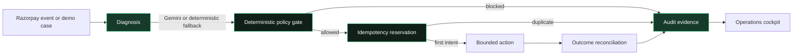

<div align="center">

# RecoverOps

### Revenue recovery that knows when to act—and when to stop

**Gemini diagnoses. Deterministic policy decides. Every action is idempotent and auditable.**

Built for the Razorpay AI Buildathon · Track 03 · AI Revenue Recovery

[Live demo](https://recoverops-demo.vercel.app) · [Demo guide](DEMO_GUIDE.md) · [Deployment guide](VERCEL_DEPLOY.md)

</div>

---

## What is RecoverOps?

RecoverOps is a deployable demonstration of a safety-first revenue-recovery agent. It diagnoses failed-payment signals, proposes a bounded next action, evaluates that proposal against deterministic controls, and records the complete decision trail.

The model is deliberately **not** the final authority. Fraud flags, customer opt-outs, cooldowns, retry limits, action boundaries, and idempotency are enforced downstream in code.

> **AI proposes. Policy disposes. The model is never the cashier.**

## Why it stands out

- **Interactive recovery lab** with seven normal and adversarial scenarios.
- **Gemini AI Lab** with structured output, visible call accounting, and deterministic fallback.
- **Safety Center** that proves immutable facts override confident but unsafe AI output.
- **Content-addressed idempotency** that prevents the same recovery intent from executing twice.
- **Replayable audit explorer** connecting facts, diagnosis, policy, action, and outcome.
- **Reproducible evaluation** with honest synthetic-data labelling and seeded confidence intervals.
- **Razorpay test-mode adapter** for signed webhooks and bounded Payment Link creation.
- **Neon persistence** for webhook events, cases, actions, reconciliation, and audit evidence.
- **Protected Operations cockpit** with privacy-safe operational metrics.
- **Responsive UI** with a purpose-built mobile navigation experience.
- **Vercel-ready deployment** with health endpoints and environment-specific secrets.

## Product tour

| Route | Purpose |
|---|---|
| `/` | Product story and interactive recovery lab |
| `/safety` | Fraud conflicts, opt-outs, cooldowns, caps, and duplicate defense |
| `/ai-lab` | Compare deterministic diagnosis with one bounded Gemini call |
| `/evaluation` | Inspect the reproducible synthetic benchmark and methodology |
| `/audit` | Search and replay structured decision events |
| `/operations` | View protected, persisted integration evidence without customer identifiers |
| `/api/health` | Application and Gemini configuration health |
| `/api/razorpay/health` | Database, schema, and Razorpay test-mode readiness |
| `/api/webhooks/razorpay` | Signed Razorpay webhook receiver |

## Architecture



### Four separated responsibilities

1. **Reasoning** — Gemini classifies a minimal, privacy-safe signal set into a closed diagnosis schema. Invalid or unavailable output falls back to deterministic logic.
2. **Policy** — code evaluates immutable facts, action eligibility, consent, fraud, cooldowns, retry caps, and amount boundaries.
3. **Execution** — an idempotency reservation happens before a bounded Razorpay test-mode Payment Link can be created.
4. **Evidence** — Neon stores accepted events, decisions, actions, reconciliation, and audit records for later inspection.

## Safety model

| Control | Guarantee |
|---|---|
| Closed diagnosis schema | Model output cannot invent executable capabilities |
| Immutable risk facts | Fraud and opt-out signals override AI recommendations |
| Deterministic policy | The final authorization decision is testable code |
| Content-addressed key | One recovery intent can reserve only one action |
| Razorpay event ID reservation | Replayed webhook deliveries do not trigger repeated processing |
| Raw-body HMAC verification | Forged webhook requests are rejected before storage |
| Test-key enforcement | The adapter rejects non-`rzp_test_` credentials |
| Bounded model usage | Gemini is called only on demand or for a newly accepted event |
| Deterministic fallback | Model failure does not make the system fail open |
| Redacted Operations API | No raw payloads, payment IDs, links, or customer fields are exposed |

## Razorpay event flow

The optional integration layer supports `payment.failed` and `payment_link.paid`:

1. Read the unmodified request body.
2. Verify `x-razorpay-signature` with HMAC-SHA256.
3. Require and reserve `x-razorpay-event-id` in Neon.
4. Return a fast acknowledgement; process accepted work in the background.
5. Diagnose the failed payment and run deterministic policy.
6. Reserve one idempotent recovery action.
7. Create a Razorpay **test-mode** Payment Link only when allowed.
8. Reconcile a later paid-link event into confirmed recovered value.

The complete interactive demo remains runnable without Razorpay credentials.

## Honest evaluation

The headline evaluation is a **synthetic, reproducible simulation**, not live merchant revenue.

| Metric | RecoverOps simulation |
|---|---:|
| At-risk records | 200 |
| At-risk value | ₹9.4L |
| Simulated recovered value | ₹3.76L |
| Simulated recovery rate | 38.1% |
| Policy decisions traced | 100% |
| Unsafe actions executed | 0 |

The benchmark separates attempted recovery, promises, and settled outcomes. Fraud blocks are treated as correct safety decisions rather than missed revenue. See the methodology and seeded intervals on `/evaluation`.

## Technology

- Next.js 15 App Router
- React 19 and TypeScript
- Gemini structured diagnosis with deterministic fallback
- Neon serverless Postgres
- Razorpay REST API and signed webhooks
- Vercel Functions and background `after()` processing
- Vitest, ESLint, and TypeScript
- CSS Modules with responsive layouts

## Run locally

### Prerequisites

- Node.js 22+
- pnpm 11

```powershell
git clone https://github.com/algosavant3010/Recoverops.git
cd Recoverops
pnpm install
Copy-Item .env.example .env.local
pnpm dev
```

Open [http://localhost:3000](http://localhost:3000).

No external secret is required for the core Recovery Lab, Safety Center, Evaluation, or Audit Explorer.

## Environment variables

```env
# Optional AI diagnosis
GEMINI_API_KEY=
GEMINI_MODEL=gemini-3.5-flash-lite

# Optional Razorpay Test Mode integration
RAZORPAY_KEY_ID=rzp_test_replace_me
RAZORPAY_KEY_SECRET=
RAZORPAY_WEBHOOK_SECRET=

# Neon Postgres
DATABASE_URL=

# Protects persisted operational evidence
OPERATIONS_DASHBOARD_TOKEN=
```

Never commit `.env.local`, expose secrets with `NEXT_PUBLIC_`, use live Razorpay keys for the demo, or display the Operations passcode in a recording.

## Test and verify

```powershell
# Unit and integration tests
pnpm test

# Type safety
pnpm typecheck

# Lint
pnpm lint

# Complete release gate
pnpm check
```

The current suite contains **16 tests across 5 test files**, covering:

- deterministic recovery behavior;
- evaluation invariants;
- Gemini API fallback behavior;
- webhook signature verification;
- missing event IDs and invalid requests;
- first-delivery scheduling;
- duplicate webhook acknowledgement;
- duplicate action prevention; and
- payment-link reconciliation.

## Deploy to Vercel

```powershell
pnpm check
vercel link
vercel deploy
```

Verify the exact preview artifact before production promotion:

```powershell
vercel promote <verified-preview-url>
```

Neon can be provisioned from the Vercel Marketplace. Add Gemini and Razorpay secrets independently for Preview and Production. Full instructions are in [VERCEL_DEPLOY.md](VERCEL_DEPLOY.md).

## Recommended demo sequence

1. State the contract: **“AI diagnoses; deterministic policy decides.”**
2. Run **Insufficient funds** in the Recovery Lab.
3. Point out the named verdict and idempotency key.
4. Open Safety Center and run the fraud-conflict scenario.
5. Prove that the unsafe recommendation is blocked.
6. Run the duplicate-delivery challenge.
7. Use the AI Lab once and show bounded external-call usage.
8. Open Evaluation and disclose the synthetic methodology.
9. Finish with one replayable decision in Audit Explorer.

See [DEMO_GUIDE.md](DEMO_GUIDE.md) for the complete presentation flow.

## Repository layout

```text
app/
├── api/
│   ├── diagnose/                 # bounded Gemini diagnosis API
│   ├── health/                   # application health
│   ├── razorpay/                 # integration health + protected evidence
│   └── webhooks/razorpay/        # signed webhook receiver
├── ai-lab/                       # Gemini comparison interface
├── audit/                        # replayable audit explorer
├── evaluation/                   # synthetic benchmark evidence
├── operations/                   # protected Operations cockpit
├── safety/                       # adversarial safety tests
└── page.tsx                      # homepage and Recovery Lab

components/
├── mobile-navigation.tsx         # advanced responsive navigation
└── subnav.tsx                    # shared product navigation

lib/
├── razorpay/
│   ├── client.ts                 # test-only Payment Link client
│   ├── handler.ts                # HTTP webhook boundary
│   ├── operations.ts             # privacy-safe read model
│   ├── store.ts                  # Neon persistence and schema
│   └── webhook.ts                # signature, processing, reconciliation
└── recoverops/
    ├── ai-diagnosis.ts           # Gemini + deterministic fallback
    ├── engine.ts                 # policy and audit engine
    ├── evaluation.ts             # reproducible benchmark
    └── scenarios.ts              # interactive demo cases
```

## Current deployment state

- Core simulation: fully runnable
- Gemini: optional; deterministic fallback included
- Neon: provisioned and schema-ready
- Operations evidence: implemented and access-controlled
- Razorpay: integration-ready; test credentials are optional for the submitted simulation
- Mobile and desktop: responsive navigation included
- Quality gate: types, 16 tests, lint, and production build passing

## Documentation

- [DEMO_GUIDE.md](DEMO_GUIDE.md) — judge flow and recording sequence
- [VERCEL_DEPLOY.md](VERCEL_DEPLOY.md) — Vercel, Neon, Gemini, and webhook setup
- [PITCH_VIDEO.md](PITCH_VIDEO.md) — pitch structure
- [PLAN.md](PLAN.md) — implementation plan
- [WHAT_BROKE.md](WHAT_BROKE.md) — engineering issues and resolutions

## License

MIT

---

<div align="center">

**RecoverOps** · Adaptive diagnosis. Deterministic control. Complete evidence.

Built by **Naman Agarwal** for the Razorpay AI Buildathon.

</div>
